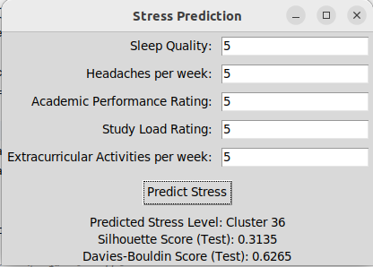

# Nội dung code

Dùng K-Means để thực hiện việc phân cụm (50 cụm)

Xâu dựng GUI dự đoán nhãn

Silhouette Score là một chỉ số để đánh giá mức độ gần gũi của các điểm dữ liệu trong cùng một cụm so với các điểm dữ liệu trong các cụm khác.

Davies-Bouldin Index là một chỉ số để đánh giá mức độ gần gũi của các cụm dựa trên tỷ lệ giữa khoảng cách trong cụm và khoảng cách giữa các cụm. 

